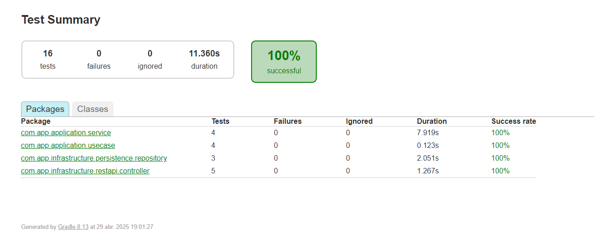

### Calculadora API
* Este servicio es una API REST que proporciona operaciones de cálculo y gestión de historial,
con el cálculo de un porcentaje aplicado a la suma de dos números. Además, mantiene un historial de cálculos realizados.
* Se ha creado un servicio que simula a un servicio externo, luego se consume via openfeign

### Tecnologías Utilizadas
* Java 21: Este proyecto está construido con Java y Spring Boot.
* Gradle: Para la gestión de dependencias y ejecución del proyecto.
* Redis: Utilizado para almacenar el porcentaje calculado en caché por 30min.
* Postman o cualquier cliente REST: Para realizar pruebas de los endpoints.
* Test unit Junit, Karma

### 1 Configuración del Proyecto
* Clonar el Repositorio:
* opción 1: url github https://github.com/mhuancho/challengebackend.git
* opción 2: docker pull mhuancho/challengebackend:latest

### 2 ejecutar el docker-compose
docker-compose up -d

### 3. Ejecutar Gradle cuando es en local:
./gradlew bootRun

### 4. Uso de Redis
* Caché del Porcentaje:
El servicio utiliza Redis para almacenar el porcentaje que se aplica a los cálculos. Este valor se recupera de Redis cuando está disponible.
* Cuando el porcentaje es calculado (por ejemplo, obteniendo un valor externo), este se almacena en Redis con una clave definida (PERCENTAGE_FIELD).
* Cuando se realiza un cálculo (usando los números proporcionados en el POST /api/calculo), el porcentaje se busca en caché. Si el servicio externo esta caido tiene tiempo de duración de 30 min. 

### 6 Puerto y URL: 
* El servicio estará disponible en http://localhost:8080/calculadora-api.
* revisar en la ruta resources/collection/challengebackend.postman_collection.json
alli se encuentran los Endpoints Disponibles

### covertura 
Una vez realizado el build ingresar a esta ruta
calculadoraapi/build/reports/tests/test/index.html

